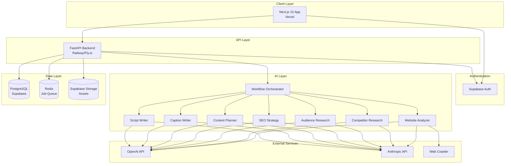
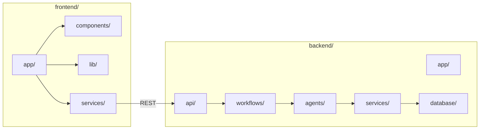
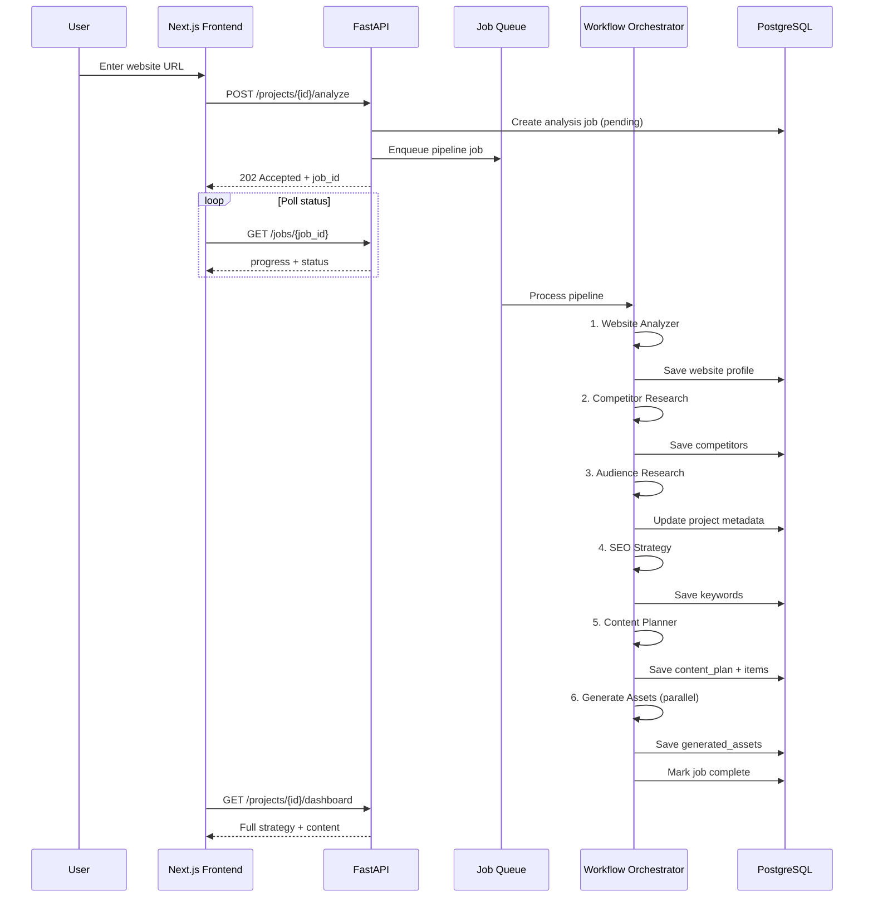
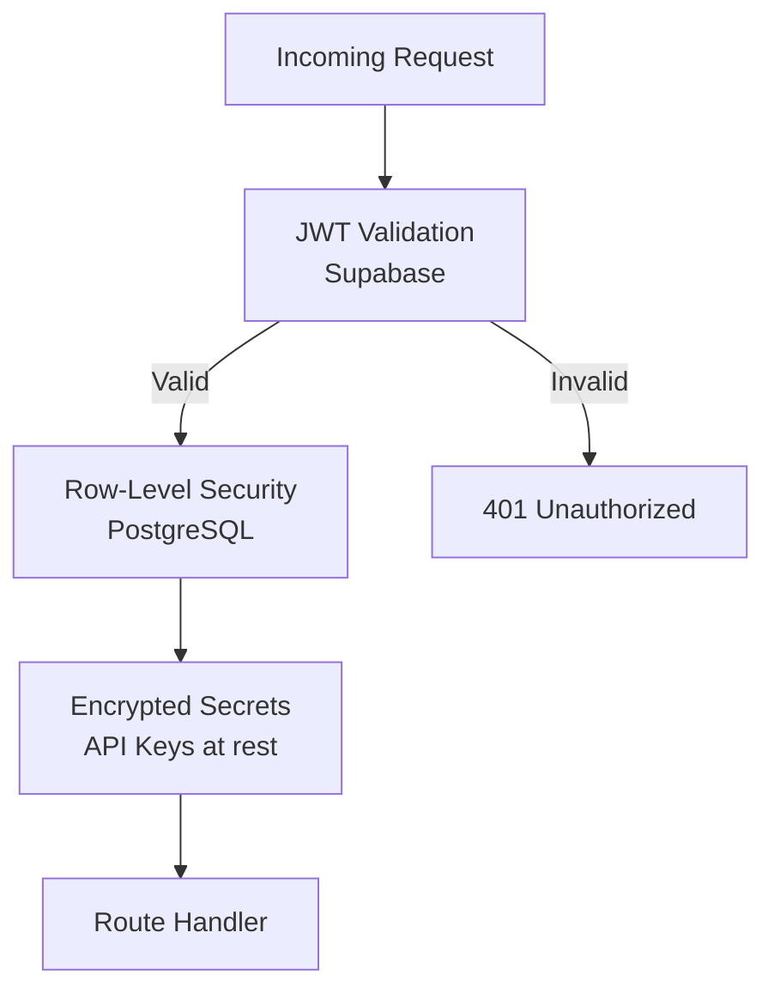

# System Architecture

## High-Level Architecture



---

## Component Architecture



---

## Analysis Pipeline Workflow



---

## Scalability Design (100K Users)

### Horizontal Scaling
- **Frontend:** Vercel edge + ISR for marketing pages
- **Backend:** Stateless FastAPI replicas behind load balancer
- **Workers:** Separate worker processes for AI pipeline (Celery/ARQ)
- **Database:** Supabase connection pooling (PgBouncer), read replicas at scale

### Caching Strategy
| Layer | Cache | TTL |
|-------|-------|-----|
| Website crawl | Redis | 24h per URL |
| AI responses | Redis | 7d per input hash |
| Dashboard data | React Query | 5min stale |
| Static assets | CDN | 1y |

### Rate Limiting
- Free: 1 analysis/month, 10 regenerations/day
- Pro: 10 analyses/month, 100 regenerations/day
- Implemented via Redis sliding window + Supabase usage table

### Multi-Tenancy
- Row-Level Security (RLS) on all Supabase tables
- `user_id` / `project_id` on every row
- API validates JWT + project ownership on every request

---

## Security Architecture



- All API routes require Bearer token from Supabase
- Service role key only on backend (never exposed to client)
- AI API keys stored in backend env only
- CORS restricted to frontend domain
- Input sanitization on URLs (SSRF prevention)

---

## Deployment Architecture

| Service | Platform | Environment |
|---------|----------|-------------|
| Frontend | Vercel | Production + Preview |
| Backend API | Railway / Fly.io | Production + Staging |
| Workers | Railway / Fly.io | Separate service |
| Database | Supabase | Managed PostgreSQL |
| Redis | Upstash | Serverless Redis |
| Storage | Supabase Storage | Generated assets |

---

## Folder Structure

```
AI Content Marketing Agent/
├── docs/                          # Documentation
│   ├── PRD.md
│   ├── ARCHITECTURE.md
│   ├── API.md
│   ├── USER_FLOWS.md
│   ├── MVP_ROADMAP.md
│   ├── PHASE2_ROADMAP.md
│   └── DEVELOPMENT_TASKS.md
├── frontend/                      # Next.js 15
│   ├── app/
│   │   ├── (auth)/               # Login, signup
│   │   ├── (dashboard)/          # Protected routes
│   │   │   ├── projects/
│   │   │   ├── calendar/
│   │   │   ├── library/
│   │   │   ├── seo/
│   │   │   └── settings/
│   │   ├── api/                  # Next.js API routes (BFF)
│   │   └── layout.tsx
│   ├── components/
│   │   ├── ui/                   # Shadcn components
│   │   ├── dashboard/
│   │   ├── content/
│   │   └── shared/
│   ├── lib/
│   │   ├── supabase/
│   │   ├── utils.ts
│   │   └── constants.ts
│   └── services/
│       ├── api-client.ts
│       ├── projects.ts
│       └── content.ts
├── backend/                       # FastAPI
│   ├── app/
│   │   ├── main.py
│   │   ├── config.py
│   │   └── dependencies.py
│   ├── api/
│   │   ├── v1/
│   │   │   ├── projects.py
│   │   │   ├── websites.py
│   │   │   ├── competitors.py
│   │   │   ├── content.py
│   │   │   ├── seo.py
│   │   │   └── jobs.py
│   │   └── router.py
│   ├── agents/
│   │   ├── base.py
│   │   ├── website_analyzer.py
│   │   ├── competitor_research.py
│   │   ├── audience_research.py
│   │   ├── seo_strategy.py
│   │   ├── content_planner.py
│   │   ├── caption_writer.py
│   │   └── script_writer.py
│   ├── workflows/
│   │   ├── analysis_pipeline.py
│   │   └── asset_generation.py
│   ├── services/
│   │   ├── ai/
│   │   │   ├── openai_client.py
│   │   │   └── anthropic_client.py
│   │   ├── crawler/
│   │   │   └── website_crawler.py
│   │   └── storage/
│   │       └── supabase_client.py
│   └── database/
│       ├── models.py
│       └── repositories/
├── supabase/
│   └── migrations/
│       └── 001_initial_schema.sql
├── docker-compose.yml
└── README.md
```
