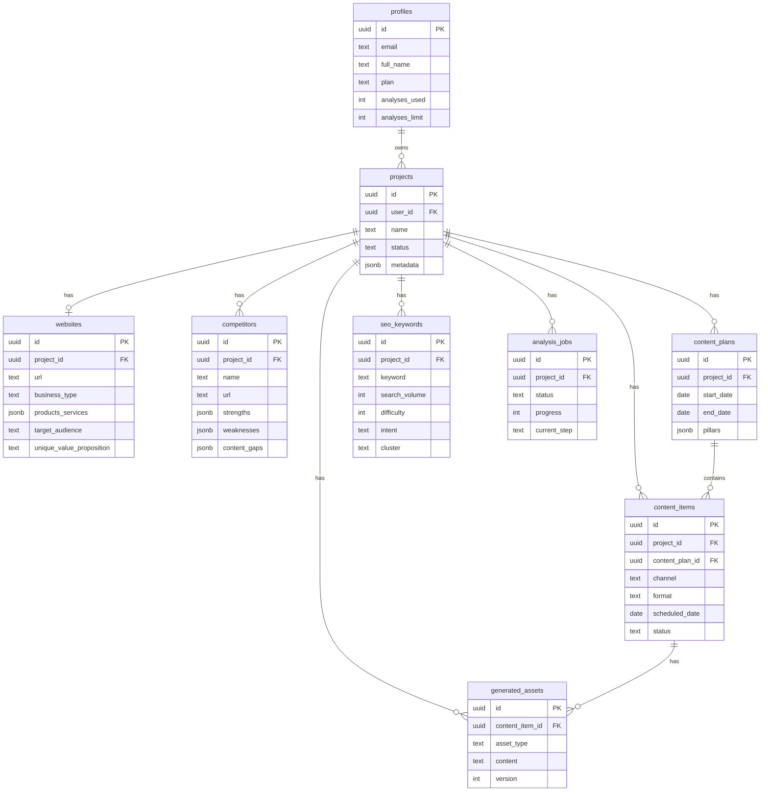

# Database Schema

PostgreSQL schema managed via Supabase. All tables use Row-Level Security (RLS).

## Entity Relationship Diagram

## Tables

### profiles
Extends Supabase `auth.users`. Auto-created on signup via trigger.

| Column | Type | Description |
|--------|------|-------------|
| id | UUID PK | References auth.users |
| email | TEXT | User email |
| full_name | TEXT | Display name |
| plan | TEXT | free, pro, team, agency |
| analyses_used | INT | Usage counter |
| analyses_limit | INT | Plan limit |

### projects
Brand/campaign workspaces owned by users.

| Column | Type | Description |
|--------|------|-------------|
| id | UUID PK | |
| user_id | UUID FK | Owner |
| name | TEXT | Project name |
| status | TEXT | draft, analyzing, active, archived |
| metadata | JSONB | Audience personas, etc. |

### websites
Analyzed website data per project.

| Column | Type | Description |
|--------|------|-------------|
| url | TEXT | Website URL |
| business_type | TEXT | e.g. B2B SaaS |
| products_services | JSONB | Array of offerings |
| target_audience | TEXT | ICP description |
| unique_value_proposition | TEXT | UVP |
| brand_tone | TEXT | Voice/tone |
| analysis_result | JSONB | Full AI output |

### competitors
Competitor intelligence per project.

### content_plans
30-day (or custom) content calendars.

### content_items
Individual pieces of content (posts, articles, videos).

**Channels:** blog, linkedin, instagram, tiktok, youtube, twitter, facebook  
**Formats:** post, article, video, reel, story, carousel, thread  
**Statuses:** draft, generating, ready, approved, rejected, published, scheduled

### seo_keywords
Keyword research with clusters and priority.

### generated_assets
AI-generated captions, scripts, outlines, image prompts.

**Asset types:** caption, script, blog_outline, image_prompt, hashtags, hook, cta

### analysis_jobs
Async pipeline job tracking with progress.

## RLS Policies

All tables enforce ownership via `user_owns_project(project_id)` helper function. Users can only access data for projects they own.

## Migration

Run `supabase/migrations/001_initial_schema.sql` in Supabase SQL Editor.
