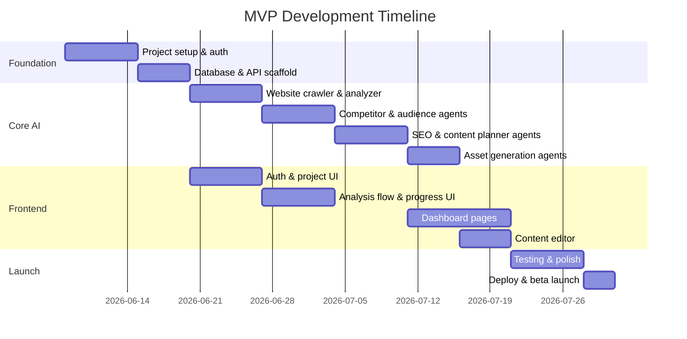

# MVP Roadmap

**Timeline:** 8–10 weeks  
**Goal:** Launchable product with core analysis → strategy → content pipeline

---

## Phase Overview

---

## Sprint Breakdown

### Sprint 1 (Week 1–2): Foundation
- [ ] Monorepo structure, Docker Compose, env templates
- [ ] Supabase project: auth, database, RLS policies
- [ ] FastAPI scaffold with auth middleware
- [ ] Next.js 15 scaffold with Tailwind + Shadcn
- [ ] Sign up / login / logout flows
- [ ] CI: lint, type-check, test on PR

**Deliverable:** User can sign up and see empty dashboard

---

### Sprint 2 (Week 3–4): Website Analysis
- [ ] Website crawler service (httpx + BeautifulSoup)
- [ ] Website Analyzer agent (Claude)
- [ ] Job queue (ARQ/Celery + Redis)
- [ ] Analysis pipeline orchestrator (steps 1–2)
- [ ] POST /analyze endpoint + job polling
- [ ] Frontend: URL input, progress screen

**Deliverable:** User enters URL, sees business profile extracted

---

### Sprint 3 (Week 5–6): Strategy Generation
- [ ] Competitor Research agent
- [ ] Audience Research agent
- [ ] SEO Strategy agent
- [ ] Content Planner agent (30-day calendar)
- [ ] Complete pipeline steps 3–5
- [ ] Competitors page UI
- [ ] SEO dashboard UI

**Deliverable:** Full strategy generated after analysis

---

### Sprint 4 (Week 7–8): Content & Assets
- [ ] Caption Writer agent
- [ ] Script Writer agent
- [ ] Asset generation workflow (parallel)
- [ ] Content Library UI with filters
- [ ] Content Calendar UI (month/week views)
- [ ] Inline editor + approve/regenerate

**Deliverable:** User can review, edit, and approve all content

---

### Sprint 5 (Week 9–10): Polish & Launch
- [ ] Error handling, retry logic, partial results
- [ ] Loading states, empty states, toasts
- [ ] Settings page (profile, usage limits)
- [ ] Landing page + marketing site
- [ ] E2E tests for critical flows
- [ ] Production deploy (Vercel + Railway)
- [ ] Beta user onboarding (10–20 users)

**Deliverable:** Public beta launch

---

## MVP Feature Checklist

| Feature | Status |
|---------|--------|
| Email + Google auth | Required |
| Create/manage projects | Required |
| Website URL analysis | Required |
| Business profile extraction | Required |
| Competitor research (5–8) | Required |
| 30-day content calendar | Required |
| SEO keyword strategy (50+) | Required |
| Blog/TikTok/YouTube/LinkedIn ideas | Required |
| Caption + script generation | Required |
| Content edit + approve | Required |
| Content library + calendar views | Required |
| Job progress polling | Required |
| Usage limits (free tier) | Required |
| Payment/billing | Deferred |
| Auto-posting | Phase 2 |
| Team collaboration | Phase 2 |

---

## MVP Success Criteria

1. End-to-end flow works for 10 beta users without manual intervention
2. Analysis completes in < 5 minutes for 90% of websites
3. > 70% of generated content items approved without major edits
4. Zero critical security issues (RLS, auth bypass)
5. Page load < 2s, dashboard interactive < 3s

---

## Technical Debt Accepted in MVP

- In-memory job queue fallback for local dev
- No payment integration (manual tier assignment)
- Basic crawler (no JS rendering — add Playwright in Phase 2)
- Single-region deployment
- No email notifications (in-app only)
