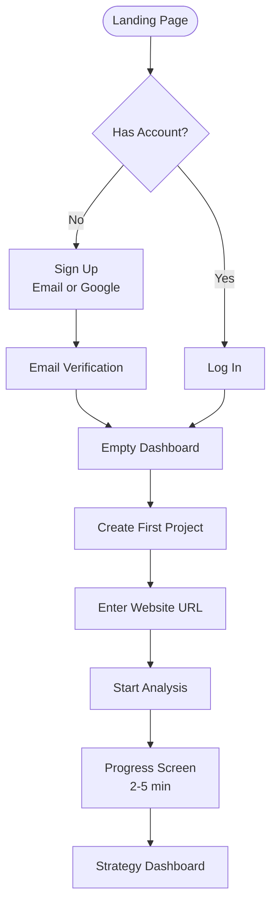
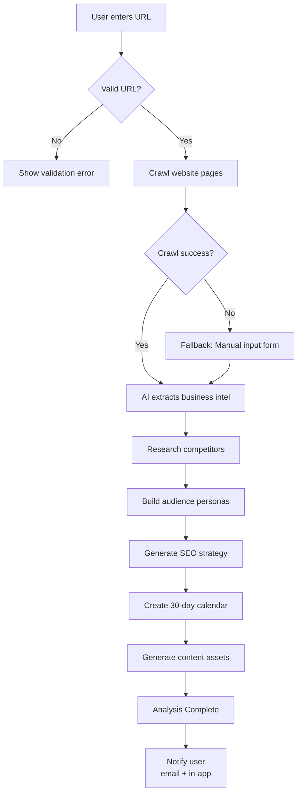
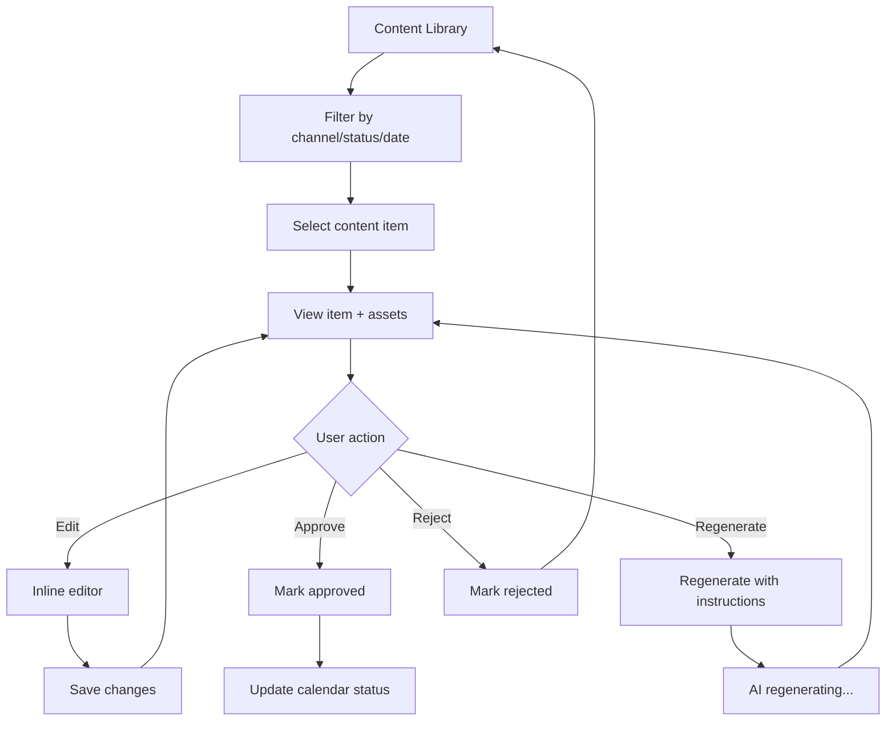
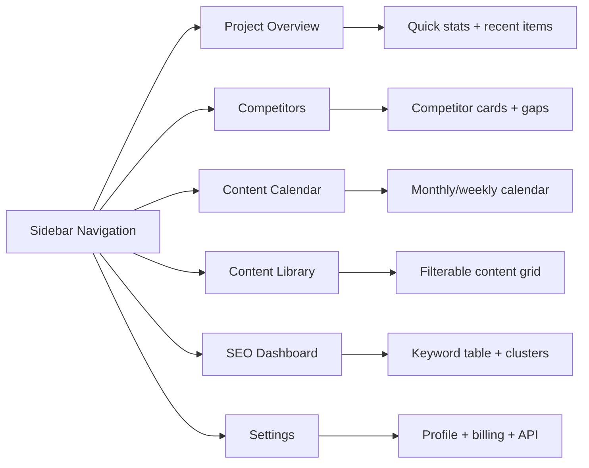
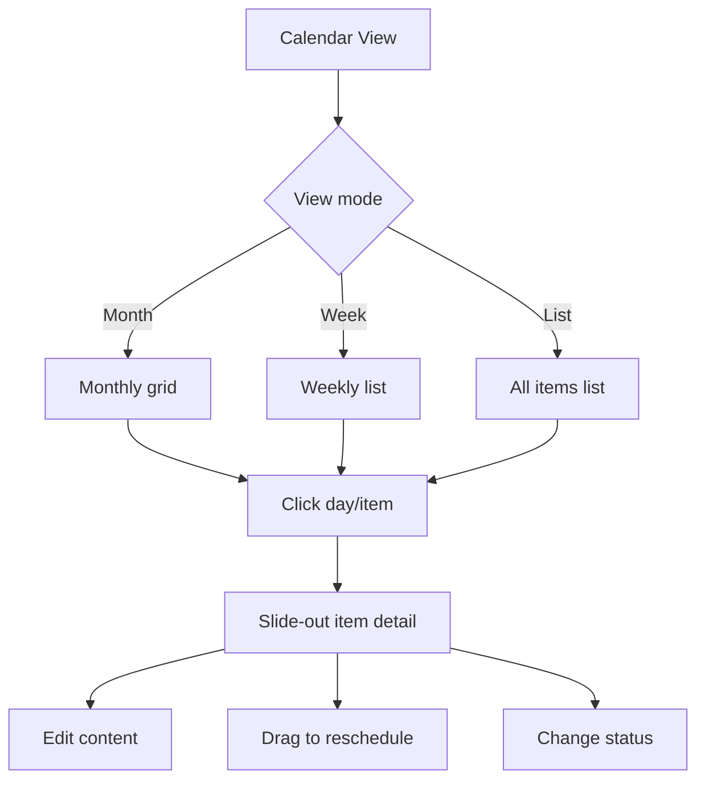
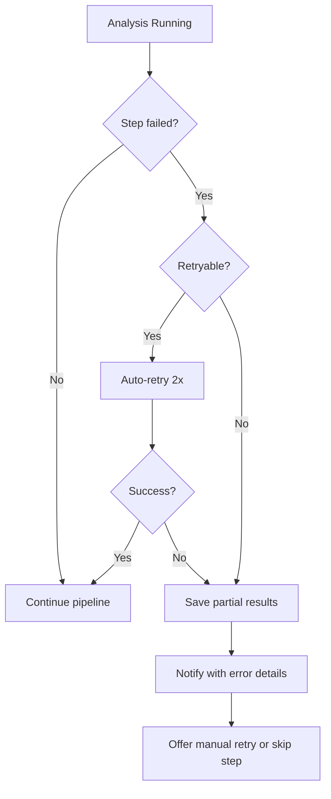
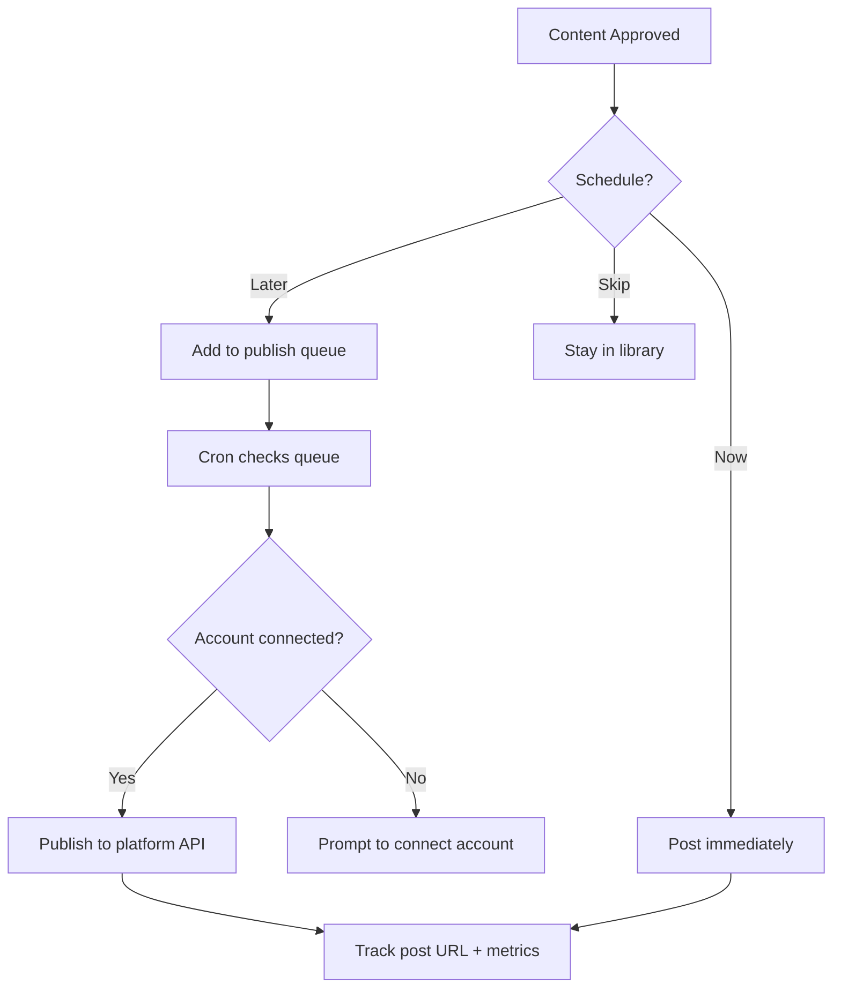

# User Flow Diagrams

## 1. Onboarding Flow

---

## 2. Website Analysis Flow

---

## 3. Content Review & Approval Flow

---

## 4. Dashboard Navigation Flow

---

## 5. Content Calendar Interaction

---

## 6. Error & Recovery Flows

---

## 7. Phase 2: Auto-Posting Flow

